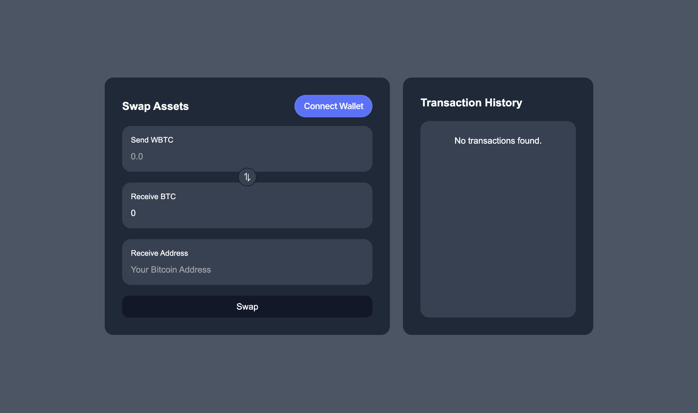

<Note>
If you are stuck at any part of the implementation, drop a message in our [Townhall](https://discord.gg/dZwSjh9922)—our dev team is ready to assist!
</Note>

This cookbook provides a step-by-step guide to integrating Garden SDK for fetching quotes, executing swaps, and tracking them. It walks through building a simple cross-chain bridge in a Next.js environment, enabling seamless swaps between BTC (`testnet4`) and WBTC (`Ethereum Sepolia`).

For a fully functional reference, check out the [Bridge](https://github.com/gardenfi/demo-app-nextjs)—a complete implementation with frontend components, allowing developers to see how these steps integrate into a working application.

## What you'll build



- **Cross-chain swaps**: Enable seamless swaps between BTC(`testnet4`) to WBTC (`Ethereum Sepolia`)
- **Real-time quotes**: Get real-time quotes for selected fromAsset, toAsset, amount params from Garden's [solver](/home/fundamentals/introduction/solvers) network
- **Initialize swap**: Initiate the swap and wait for the solver to initiate
- **Order status tracking**: Keep users informed about the status of their swaps

## Setting up the SDK

The `GardenProvider` is the core of the SDK integration. It acts as a wrapper around your application, handling:

- **Session management**: Maintains active user sessions and transaction state
- **Wallet connectivity**: Manages wallet connections, transaction signing, and approvals
- **Environment configuration**: Switches between testnet and mainnet as needed

Before interacting with the SDK, wrap your application with the GardenProvider. The provider requires walletClient, which is provided by wagmi. For this, you'll need to:

1. Get the [walletClient](https://wagmi.sh/react/api-reference/hooks/useWalletClient) using the `useWalletClient` hook
2. Pass it to your `GardenProvider` configuration

Here's how you set it up:

<CodeGroup>

```tsx GardenProvider.tsx
"use client";

import { GardenProvider } from "@gardenfi/react-hooks";
import { Environment } from "@gardenfi/utils";
import { useWalletClient } from "wagmi";

const getStorage = (): Storage => {
  if (typeof window !== "undefined") {
    return localStorage;
  }

  return {
    getItem: () => null,
    setItem: () => {},
    removeItem: () => {},
    clear: () => {},
    length: 0,
    key: () => null,
  };
};

function GardenProviderWrapper({ children }: { children: React.ReactNode }) {
  const { data: walletClient } = useWalletClient();

  return (
    <GardenProvider
      config={{
        store: getStorage(),
        environment: Environment.TESTNET,
        walletClient: walletClient,
      }}
    >
      {children}
    </GardenProvider>
  );
}

export default GardenProviderWrapper;
```

</CodeGroup>

## Fetching quotes

Now that you have your `walletClient`, you can use it to initialize the `GardenProvider`. Before diving into swap, your app needs to fetch real-time quotes for their swap params `fromAsset`, `toAsset`, `amount`.

The `getQuote` hook from Garden SDK provides real-time USD values and exchange rates for any two [supported assets](/developers/supported-chains). You'll need to provide:

- `fromAsset`: The token you want to swap from
- `toAsset`: The token you want to receive
- `amount`: The amount you want to swap
- `isExactOut`: Whether you're specifying the input or output amount

Here's how you implement:

<CodeGroup>

```tsx SwapComponent.tsx
import { useGarden } from "@gardenfi/react-hooks";
import BigNumber from "bignumber.js";

const SwapComponent = () => {
  const { getQuote } = useGarden();
  const { swapParams } = swapStore();

  const fetchQuote = async (amount: string) => {
    if (!getQuote) return;

    const amountInDecimals = new BigNumber(amount).multipliedBy(
      10 ** swapParams.fromAsset.decimals
    );

    const quote = await getQuote({
      fromAsset: swapParams.fromAsset,
      toAsset: swapParams.toAsset,
      amount: amountInDecimals.toNumber(),
      isExactOut: false,
    });
  };
};
```

```ts SwapStore.ts
import { SupportedAssets } from "@gardenfi/orderbook";
import { SwapParams } from "@gardenfi/core";
import { create } from "zustand";

interface SwapState {
  swapParams: SwapParams;
  setSwapParams: (params: Partial<SwapState["swapParams"]>) => void;
}

export const swapStore = create<SwapState>((set) => ({
  swapParams: {
    fromAsset: SupportedAssets.testnet.ethereum_sepolia_WBTC,
    toAsset: SupportedAssets.testnet.bitcoin_testnet_BTC,
    sendAmount: "0",
    receiveAmount: "0",
    additionalData: { strategyId: "" },
  },
  setSwapParams: (params) =>
    set((state) => ({
      swapParams: { ...state.swapParams, ...params },
    })),
}));
```

</CodeGroup>

## Executing swap

Now that you have the quotes, it's time to execute the swap. Garden SDK provides the `swapAndInitiate` hook that handles the entire swap process for you.

Here's what it does:
1. Creates your swap order
2. Waits for it to be matched with a right [solver](/home/fundamentals/introduction/solvers)
3. Automatically initiates the swap if you're on an EVM chain

You'll need to provide the swap parameters (including the quote details you got earlier). The hook will return either a matched order or an error message if something goes wrong.

Here's how you can implement this:

<CodeGroup>

```tsx TokenSwap.tsx
import { useGarden } from "@gardenfi/react-hooks";

const TokenSwap = () => {
  const { swapAndInitiate } = useGarden();

  // we get the strategyId and receiveAmount from the quote response
  const performSwap = async (strategyId: string, receiveAmount: string) => {
    const response = await swapAndInitiate({
      fromAsset: swapParams.fromAsset,
      toAsset: swapParams.toAsset,
      sendAmount,
      receiveAmount,
      additionalData: {
        btcAddress,
        strategyId,
      },
    });

    console.log(response);
    return response;
  };
};
```

```ts SwapParams.ts
// type defined in @gardenfi/core
export type SwapParams = {
    /**
     * Asset to be sent.
     */
    fromAsset: Asset;
    /**
     * Asset to be received.
     */
    toAsset: Asset;
    /**
     * Amount in lowest denomination of the asset.
     */
    sendAmount: string;
    /**
     * Amount in lowest denomination of the asset.
     */
    receiveAmount: string;
    /**
     * Time lock for the swap.
     */
    timelock?: number;
    /**
     * This will wait for the specified number of confirmations before redeeming the funds.
     */
    minDestinationConfirmations?: number;
    /**
     * Unique nonce for generating secret and secret hashes. If not provided, it will be generated as the total order count until now + 1.
     */
    nonce?: number;
    /**
     * Additional data for the order.
     */
    additionalData: {
        /**
         * Get strategy id from the quote
         */
        strategyId: string;
        /**
         * Provide btcAddress if the destination or source chain is bitcoin. This address is used as refund address if source chain is bitcoin, and as redeem address if destination chain is bitcoin.
         */
        btcAddress?: string;
    };
};
```

```ts MatchedOrder.ts
// type defined in @gardenfi/orderbook
export type MatchedOrder = {
    created_at: string;
    updated_at: string;
    deleted_at: string | null;
    source_swap: Swap;
    destination_swap: Swap;
    create_order: CreateOrder;
};
```

</CodeGroup>

## Fetching order status

Your swap is now initiated, but what's happening with your order? You can keep your users informed! Instead of redirecting users to [Garden Explorer](https://explorer.garden.finance/), you can create a better user experience by tracking the order status right in your app.

The Garden SDK simplifies this with the `ParseOrderStatus` function, which determines the order's current state. By checking block numbers on both chains, it can identify if the order is:

- `Expired` - The user's swap has expired, and they have to refund their funds
- `Initiated` - User initiated, waiting for counterparty to initiate
- `Redeemed` - User redeemed, counterparty has to redeem
- `Refunded` - User refunded

Here's how you can implement this status tracking:

<CodeGroup>

```tsx OrderStatusParser.tsx
import { ParseOrderStatus } from "@gardenfi/core";

const OrderStatusParser = () => {
  const status = ParseOrderStatus(
    order.val,
    blockNumbers.val[order.val.source_swap.chain],
    blockNumbers.val[order.val.destination_swap.chain],
  );
  console.log('status:', status);
};
```

</CodeGroup>

You have now everything needed to build a simple swap application using the Garden SDK.

## Next steps

By following this cookbook, you've implemented the core functionalities of a bitcoin bridge application using Garden SDK. If you are interested in building further, consider implementing:

- **Robust error handling** to manage API failures and network disruptions gracefully
- **Notifications or status updates** to keep users informed on swap progress and completion
- **Expanded asset support** to extend swap functionality across more chains and tokens
- **UI/UX improvements** such as progress indicators, transaction history, and user-friendly prompts to create a more intuitive and seamless experience

<CardGroup cols={2}>
  <Card title="API Integration" href="/developers/cookbook/integrate">
    Learn to integrate with Garden API directly
  </Card>
  <Card title="SDK Reference" href="/developers/sdk/sdk">
    Explore the complete SDK documentation
  </Card>
</CardGroup>
